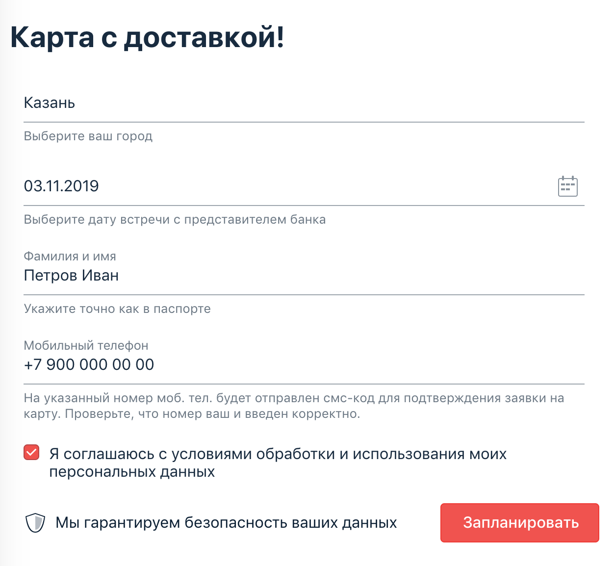

### DESCRIPTION
Форма заказа карты с возможностью перепланирования встречи.

### [TASK 1](https://github.com/netology-code/aqa-homeworks/tree/master/patterns)
Авто-тесты новой функции формы заказа доставки карты.
Тестируемая функциональность: если заполнить форму повторно теми же данными за исключением "Даты встречи", 
то система предложит перепланировать время встречи:

После нажатия на кнопке "Перепланировать" произойдёт перепланирование встречи:

### [TASK 2](https://github.com/netology-code/aqa-homeworks/tree/master/reporting)
Автоматизированное тестирование функции перепланирования встречи с использованием фреймфворка Allure.

### TOOLS
Page Object  
AppVeyor, Gradle, Selenide, Lombok, Allure, Faker

**CI**  

### LAUNCH
1. Запускаем приложение ``java -jar ./artifacts/app-card-delivery.jar``
1. Открываем в браузере http://localhost:9999/
1. Запускаем тесты в IDEA ``gradlew clean test allureReport``, ``gradlew allureServe``

### CONCLUSION
Уведомление "перепланирования даты встречи" в приложении заказа карты возникает даже если не изменять дату. [Issue](https://github.com/Kasparidi/CardOrderReschedule/issues)
